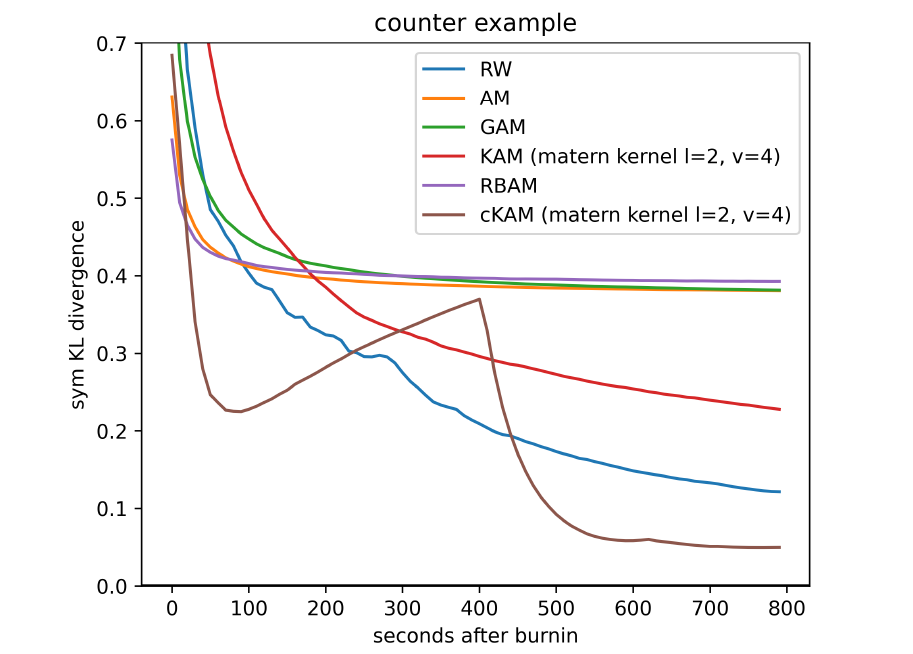

# Cyclical Kernel Adaptive Metropolis

We introduce cKAM, cyclical Kernel Adaptive Metropolis, a gradient-free adaptive MCMC algorithm which incorporates a cyclical stepsize scheme to allow control for exploration and adaptive sampling. The paper can be found in https://arxiv.org/pdf/2206.14421.pdf.

 

# Adaptive MCMC
In addition to cKAM, we implement following adaptive MCMC algorithms:
- **RW**: Random-Walk Metropolis–Hastings with isotropic gaussian proposal
- **AM**: Adaptive Metropolis with a learned covariance matrix and fixed stepsize
- **RBAM**: Rao-Blackwellised AM algorithm
- **GAM**: Adaptive Metropolis with a learned covariancematrix and a global stepsize
- **KAM**: Kernel Adaptive Metropolis

For the details of these algorithms, please refer to our paper. 

## Running adaptive MCMC
The demo for adaptive MCMC algorithms can be found in the two notebooks `cKAM.ipynb` (containing cKAM and KAM), and `adaptiveMH.ipynb` (containing all others).

## Experiments
We tested adaptive MCMC algorithms in three experiments: 1) A difficult 2D Bimodal distribution, 2) A 2D Gaussian Mixtures with increasing Std, and 3)  High-dimensional Gaussian Mixtures. The scripts for running these experiments can be found in `\experiments`.

# Cite us

If you find cKAM helpful in your research, please consider citing us:

    @misc{https://doi.org/10.48550/arXiv.2206.14421,
      doi = {10.48550/arXiv.2206.14421},
      url = {https://arxiv.org/abs/2206.14421},
      author = {Li, Jianan Canal and Zeng, Yimeng and Guo, Wentao},
      title = {Cyclical Kernel Adaptive Metropolis},
      publisher = {arXiv},
      year = {2022},
      copyright = {Creative Commons Attribution 4.0 International}
    }
    